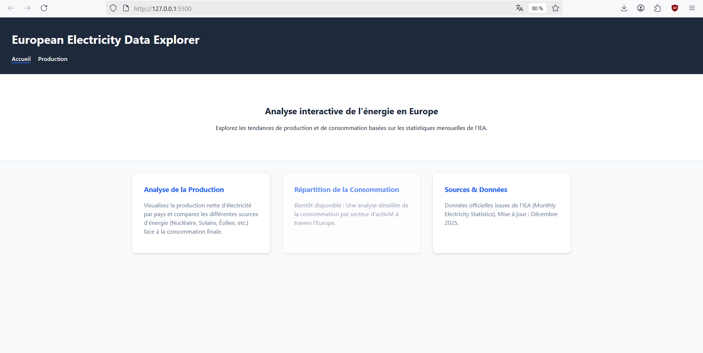
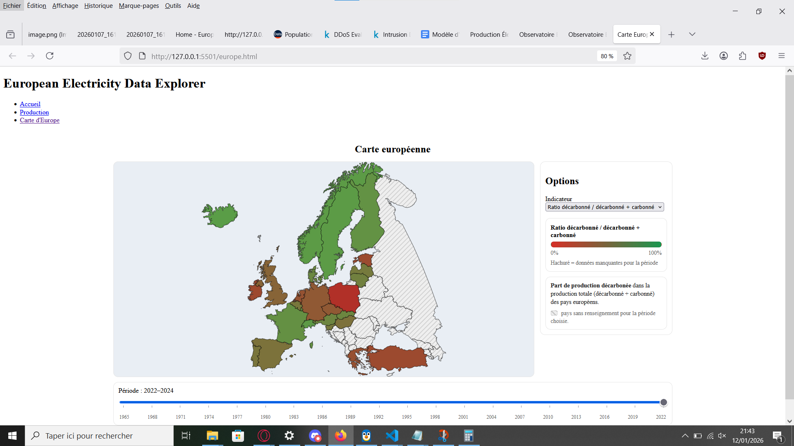
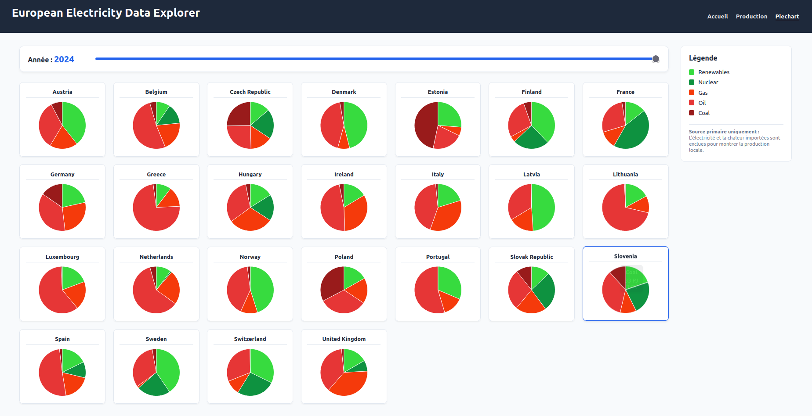
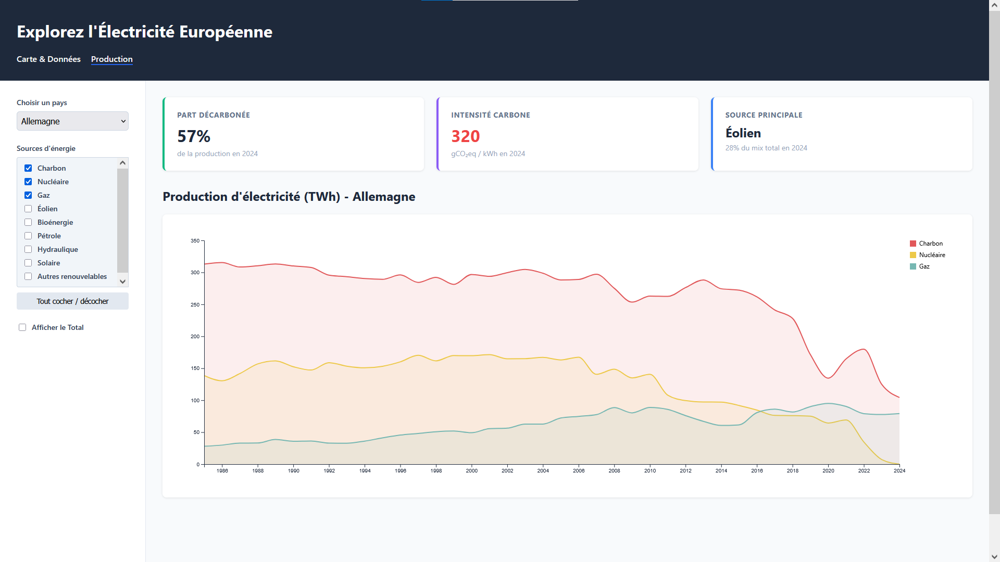
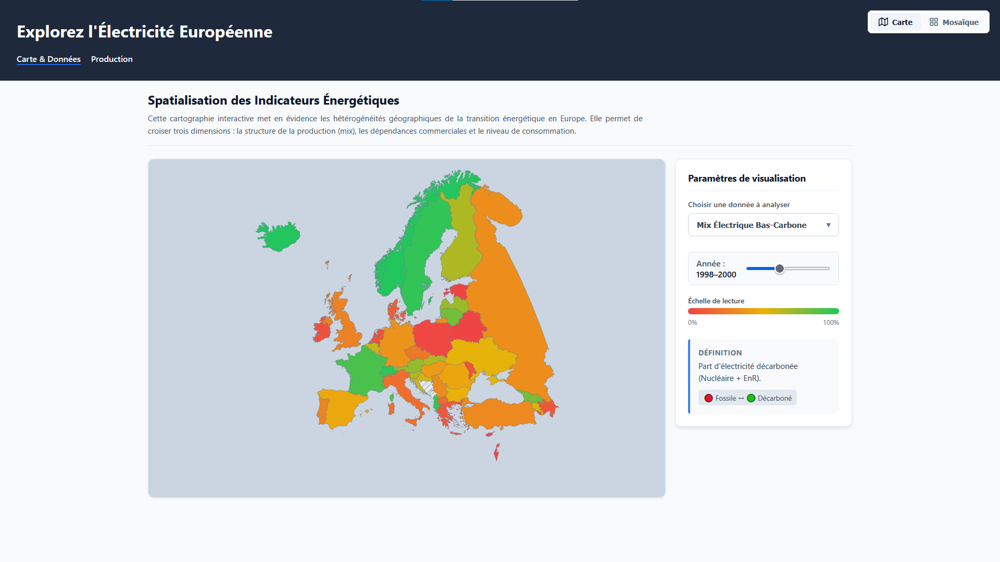

# Cahier d'avancement : EU-Energy-Analytics

## Semaine 1 : Lancement et conception

* **Choix du sujet :** Nous avons validé l'idée de visualiser la production et la consommation énergétique en Europe. L'objectif est de comparer les mix énergétiques nationaux.
* **Conception :** Réalisation des premiers croquis et schémas à la main pour imaginer l'interface (voir section cadrage).
* **Technique :** Validation de l'utilisation de D3.js pour la partie visualisation.

## Semaine 2 : Cadrage et définition du périmètre

* **Document de cadrage :** Rédaction formelle des objectifs et identification des sources de données.
* **Revue par les pairs :** Présentation du concept et réception des premières critiques pour affiner notre approche.
* **Pistes d'amélioration :** Nous avons envisagé d'ajouter une frise chronologique des événements majeurs en Europe (guerres, traités) pour contextualiser les données, une idée gardée en réserve pour la suite.

## Semaine 3 : Premiers développements et obstacles

* **Architecture :** Création de la structure HTML de base (`europe.html`, `pie-chart.html`, `donnee.html`) et mise en place du CSS global.
* **Implémentation D3.js :** Premiers graphiques fonctionnels.
* **Problèmes rencontrés :**
    * Nous avons détecté des erreurs dans les formules de calcul de la part "décarbonée", les pourcentages affichés étaient incorrects.
    * Réflexion sur la sémiologie graphique : choix des gradients de couleur pour ne pas stigmatiser les pays importateurs (être importateur n'est pas nécessairement négatif).

* **Avancement :** La Version 1 de la vue détaillée est prête.

## Semaine 4 : Cartographie et divergence des données

* **Carte Interactive (V1) :** Mise en place de l'affichage géographique initial.
* **Pie-charts (V1) :** Création des visualisations pour la répartition du mix énergétique.
* **Interactions :** Ajout des infobulles (tooltips) sur la carte pour afficher les détails au survol.
* **Problème technique majeur :** Les fichiers CSV utilisés pour les pie-charts et ceux pour la carte provenaient de sources différentes, créant des incohérences visuelles qu'il faudra corriger.
* **Manques identifiés :** Il manque encore les options de filtrage (Import/Export, Consommation par habitant) sur l'interface.

## Semaine 5 : Standardisation et refonte UX

* **Nettoyage des données :**
    * Standardisation des CSV et des méthodes de calcul entre toutes les pages.
    * Suppression des pays hors périmètre pertinent (Israël, Kazakhstan, etc.) pour se concentrer sur l'Europe géographique.
    * Mise en place d'un lissage des données sur la carte (moyenne par lot de 3 ans) pour combler les années manquantes et éviter les "trous" visuels.

* **Expérience utilisateur (UX) :**
    * Suppression de la page d'accueil (`index.html`) jugée superflue, au profit d'une arrivée directe sur la carte interactive.
    * Mise en place de la redirection : cliquer sur un pays renvoie vers sa page de détail.
    * Fusion des pages : intégration de la vue "Pie-chart" directement dans l'interface de la carte (devenue la vue Grid/Mosaïque).

* **Questionnement :** Nous nous sommes interrogés sur la pertinence de conserver la Russie. Elle est maintenue pour le contexte géographique malgré les réserves sur les données.

## Semaine 6 : Finalisation et Polissage

* **Harmonisation :** Uniformisation du design et de la navigation entre les différentes pages pour un rendu cohérent.
* **Refactorisation :** Nettoyage du code JavaScript et fusion des branches de travail pour la version finale ("Merge").
* **État final des vues :**
* **Vue Production :** Terminée, avec graphiques d'évolution temporelle fonctionnels.
* **Vue Carte :** Finalisée avec les modes interactifs.

* **Derniers ajustements :**
    * Correction finale des palettes de couleurs.
    * Vérification des calculs.
    * Ajout des sources manquantes dans les légendes.

* **Décision finale :** Abandon de la fonctionnalité "Incidents majeurs" pour privilégier la fiabilité et la clarté des visualisations existantes.

## Semaine 7 : Must to do et nice to do

* **Must to do :** Améliorer la navigation et la rendre plus cohérente; Carte: changer le dropdown de choix; Small multiples : améliorer la densité et lisibilité des graphiques
* **Nice to do :** Améliorer le lien entre timeline et carte

* **Refactorisation :** Correction du code et fusion des pages carte et détail. Pies simplifié.
* **Vue Production :** Terminée, Carte + Graphe sur la même page et scroll automatique lors de la sélection d'un pays.
