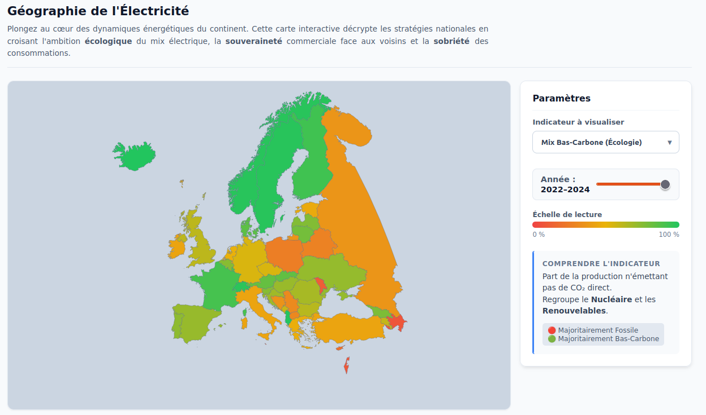

# 🇪🇺 EU Energy Analytics


<div align="center">
  <a href="https://thomas-aub.github.io/EU-Energy-Analytics">
    
  </a>
</div>

###### [🌐 Accéder à la visualisation en ligne](https://thomas-aub.github.io/EU-Energy-Analytics)

**EU Energy Analytics** est une plateforme de visualisation de données interactive conçue pour explorer et comprendre les dynamiques énergétiques en Europe. Face à la double crise climatique et énergétique, ce projet permet de dépasser les idées reçues en offrant une vue claire sur la production d'électricité, l'indépendance énergétique et la transition écologique des pays de l'Union.

---

### Contexte et Objectifs

L'Europe traverse une période charnière concernant son autonomie énergétique. Pour un citoyen, il est souvent complexe de saisir :

* Quels pays sont réellement les plus "verts" (ratio bas-carbone) ?
* Qui dépend de ses voisins pour l'électricité (import/export) ?
* Quelles sont les trajectoires historiques de transition (abandon du charbon, essor du renouvelable) ?

Ce projet répond à ce besoin de vulgarisation à travers une interface simple et précise, développée en **D3.js**.

### Visualisations et Fonctionnalités

L'application se décompose en trois niveaux de lecture :

#### 1. La Carte Interactive (Vue Spatiale)

Un point d'entrée géographique pour comparer la situation actuelle et passée des pays européens.

* **Indicateurs :** Mix Bas-Carbone (Écologie), Indépendance (Souveraineté), Conso/Habitant (Sobriété).
* **Interactions :** Slider temporel (1990-2024), Tooltips détaillés, et navigation vers le détail par pays.

#### 2. La Vue Mosaïque / Grid (Vue Comparative)

Une vue d'ensemble "Small Multiples" permettant de comparer d'un seul coup d'œil tous les pays selon des critères spécifiques.

* **Modes :** Composition du mix (Pie charts), Trajectoires de transition (Courbes fossiles vs décarbonées) et Balance commerciale.

#### 3. Le Détail par Pays (Vue Temporelle)

Une analyse approfondie de l'historique de production pour un pays donné.

* **Graphiques :** Stacked Area Charts et Line Charts pour visualiser l'évolution des sources (Nucléaire, Gaz, Charbon, Éolien, etc.).
* **Statistiques clés :** Calcul en temps réel de la part décarbonée et de l'intensité carbone (gCO₂eq/kWh).

### Sources de Données

Les données utilisées proviennent d'organismes de référence et ont été traitées pour permettre une comparaison historique fluide :

1. **IEA (International Energy Agency) :** Données brutes sur les bilans énergétiques.
2. **Our World in Data :** Données consolidées sur la production d'électricité (`electricity-prod-source-stacked.csv`) et la consommation (`primary-energy-cons.csv`).
3. **Eurostat / ONU :** Données démographiques pour les normalisations par habitant.

## 🇬🇧 English Summary

**EU Energy Analytics** is an interactive data visualization project built with D3.js offering a deep dive into Europe's electricity landscape.

* **Goal:** Help users understand the energy transition, sovereignty issues, and ecological impact of European countries.
* **Features:**
* **Interactive Map:** Visualize low-carbon ratios, trade balance, and consumption per capita across time.
* **Grid View:** Compare country trajectories side-by-side (Fossil vs. Green energy evolution).
* **Country Detail:** Explore historical production data (Nuclear, Renewables, Gas, Coal) with precise analytics.


* **Tech Stack:** Native HTML/CSS and D3.js (v7).


### 🛠️ Installation et Lancement local

Ce projet est statique (HTML/CSS/JS) mais nécessite un serveur local pour charger les fichiers de données (CSV/JSON) en raison des politiques de sécurité des navigateurs (CORS).

#### Prérequis

* Un navigateur web moderne.
* Python (installé par défaut sur la plupart des OS) ou une extension VS Code comme "Live Server".

#### Étapes

1. **Cloner le dépôt :**
```bash
git clone https://github.com/thomas-aub/EU-Energy-Analytics.git
cd EU-Energy-Analytics

```


2. **Lancer un serveur local :**
* *Option A (avec Python) :*
```bash
python -m http.server 8000

```


* *Option B (avec Node.js) :*
```bash
npx http-server

```


3. **Accéder au site :**
Ouvrez votre navigateur et allez à l'adresse : `http://localhost:8000`


---

**Équipe projet :** Thomas, Fantin, Nessim.
